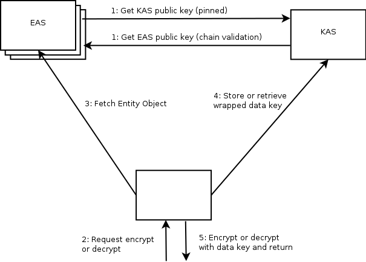
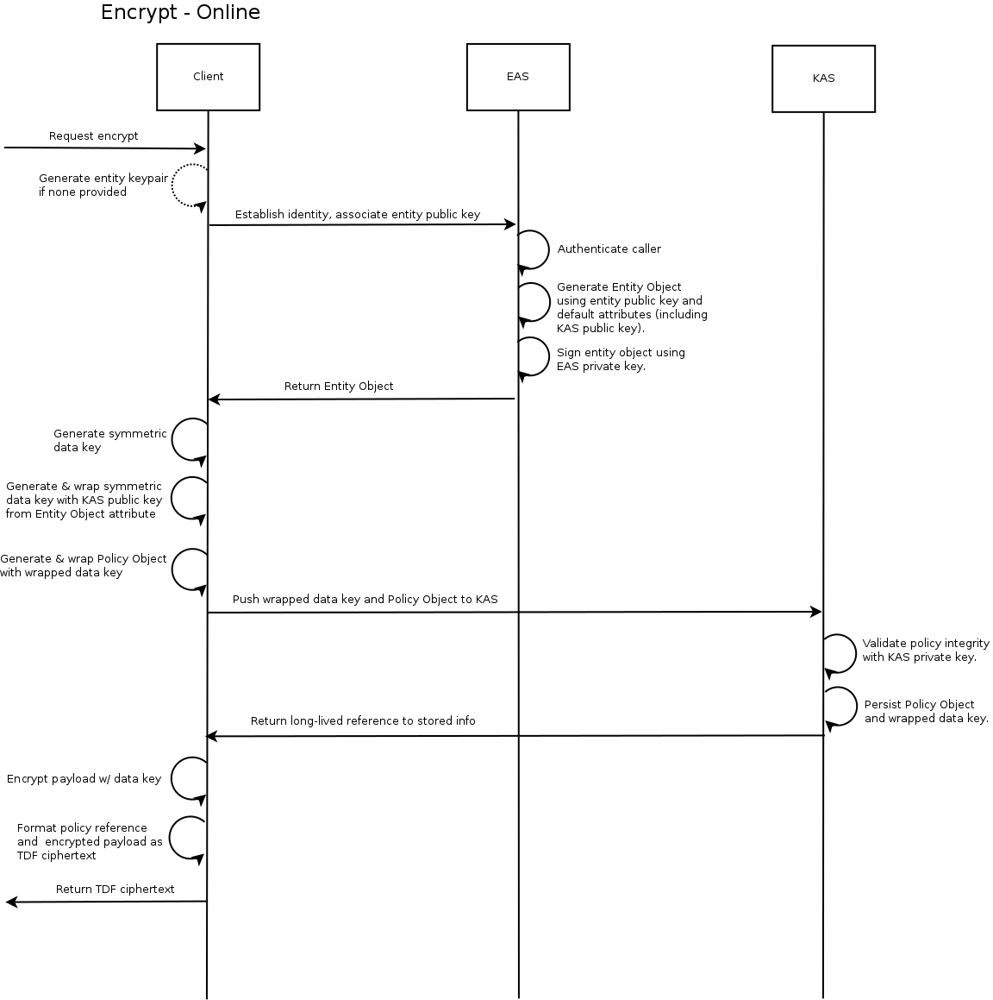
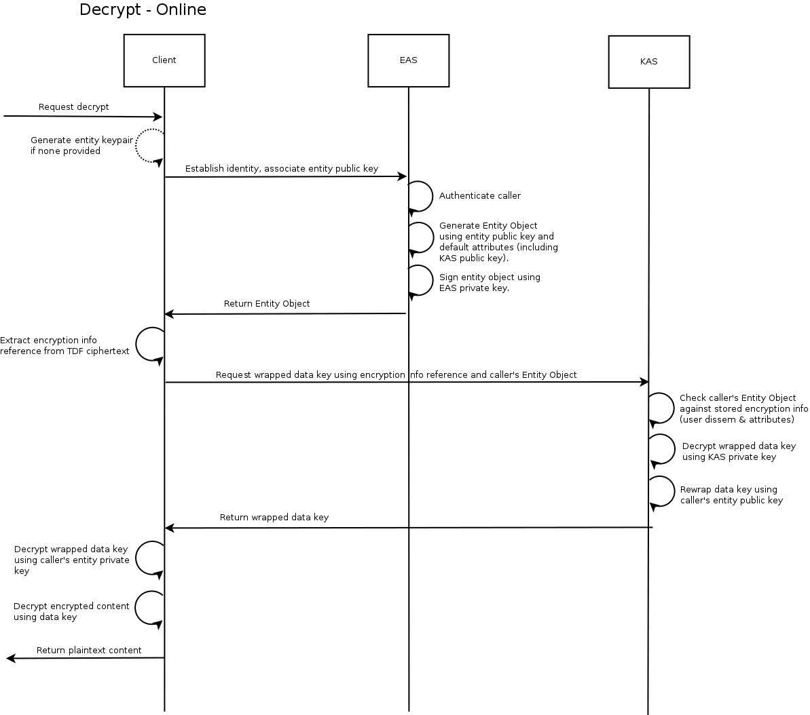
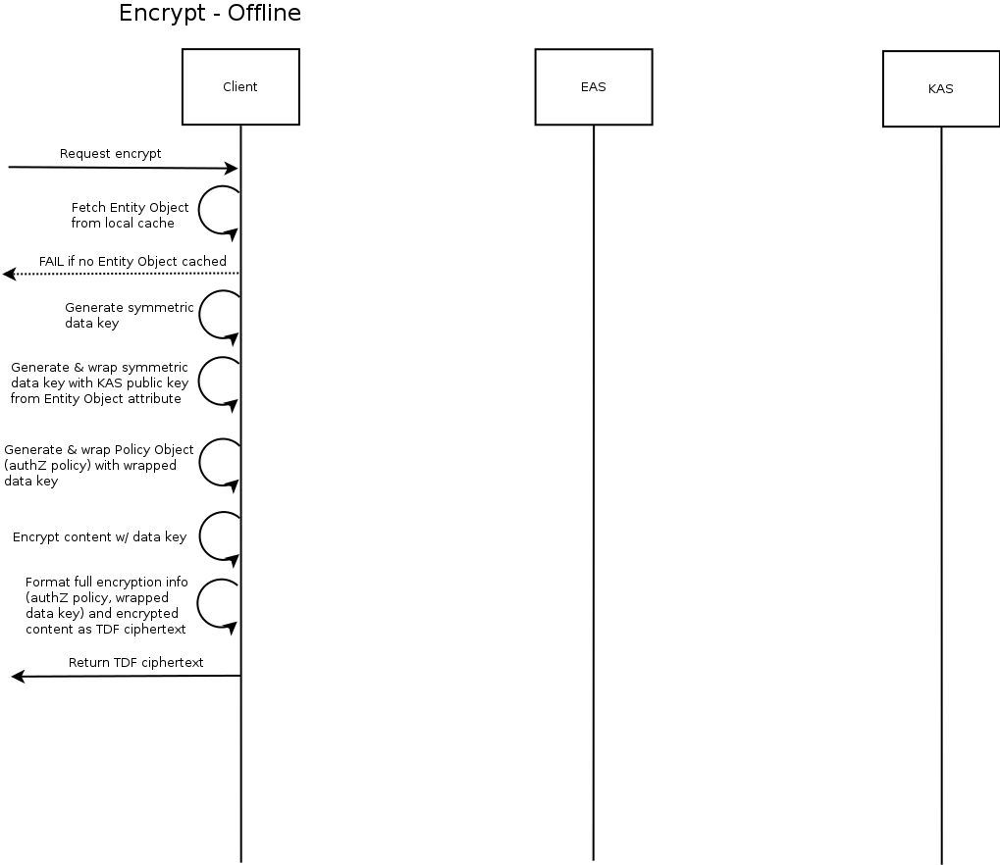
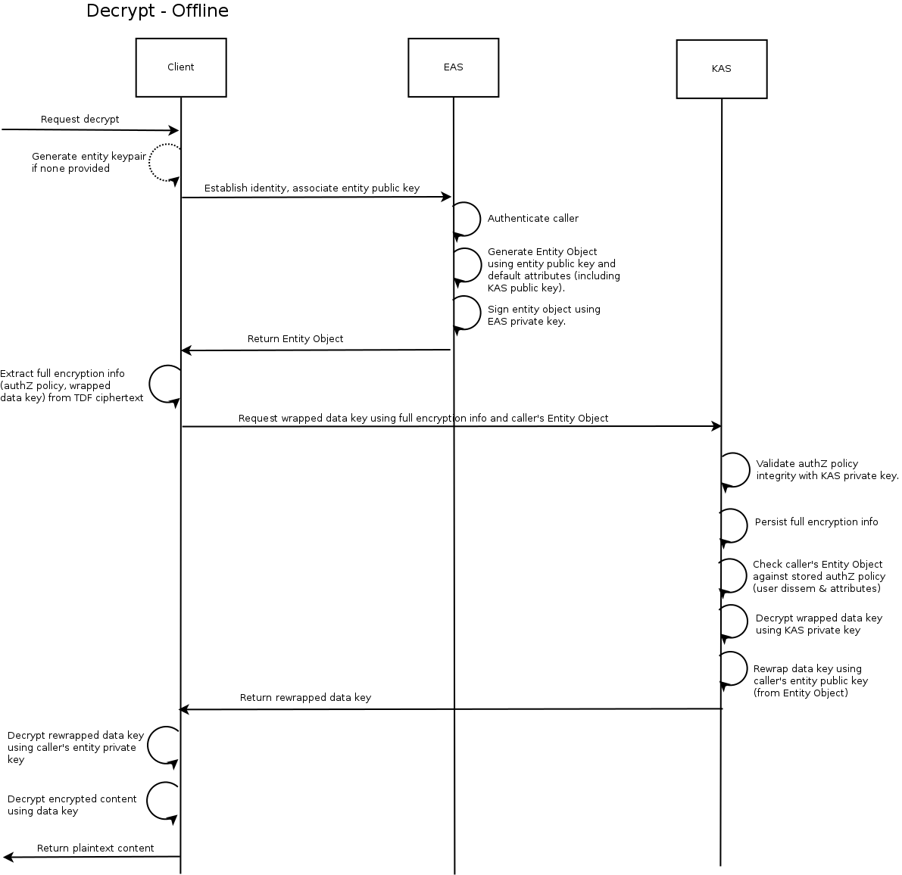

# Protocol

This document describes the canonical system architecture used to encrypt and decrypt TDF ciphertext.

## Architecture

The canonical architecture contains three major components.

* *TDF Client* - Initiates and drives the TDF encryption and decryption workflows. Only component with access to the content (ciphertext or plaintext).
* *Entity Attribute Service* (EAS) - Responsible for authenticating TDF Clients and vending them signed [Entity Objects](../schema/EntityObject.md), which act as bearer tokens. The source of truth for attribute provenance and association. A single architecture can have many EAS instance running, for instance, for a TDF Client to join attributes across mulitple orginizations.
* *Key Access Service* (KAS) - Responsible for authorizing and granting TDF Clients access to rewrapped data key material. If authorized, TDF Clients can use this rewrapped data key to decrypt TDF ciphertext.

## Workflow

The following sequence diagrams illustrate the workflow taken by the client to encrypt or decrypt TDF ciphertext. The canonical TDF architecture supports two modes of operation: _online mode_ and _offline mode_, which have distinct workflows as shown below.

_Online mode_ is the default mode, where the [wrapped data key](../schema/KeyAccessObject.md) and [authorization policy](../schema/PolicyObject.md) for TDF ciphertext is committed to KAS in-band as part of the `encrypt` operation. This means that the `encrypt` will succeed if and only if all resources are prepared to facilitate an immediate decrypt.

_Offline mode_ requires that the TDF Client previously authenticated with EAS to get a valid Entity Object. Clients running in this mode commit the [authorization policy](../schema/PolicyObject.md) out-of-band, or when decrypt is first performed. This significantly reduces latency at the cost of larger ciphertext (as the entire wrapped key and policy information must be included). 

Long-lived entity objects can be made available for certain _offline mode_ use cases, for instance, sensors with intermittent or low-bandwidth connectivity can have an Entity Object flashed onto the device during manufacturing.

### Encrypt

### Decrypt

#### Offline Encrypt

#### Offline Decrypt

Note: offline decrypt here means decrypting an offline-encrypted TDF.

