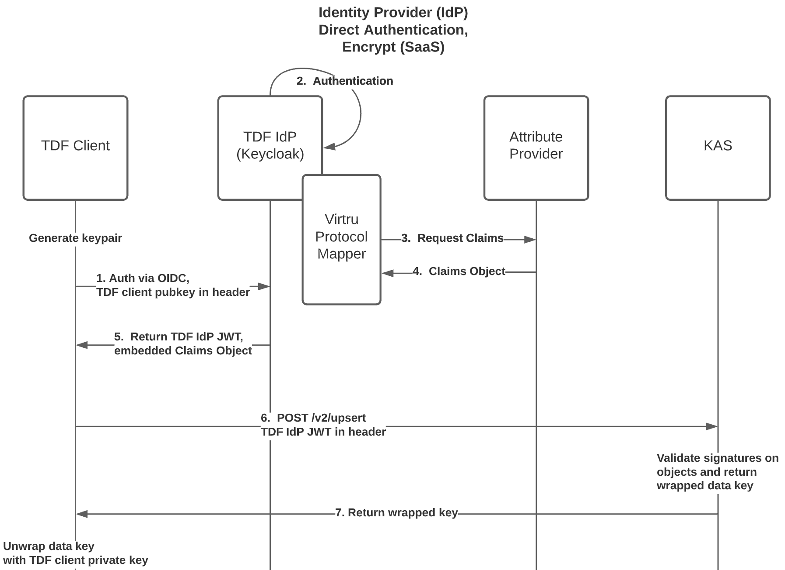
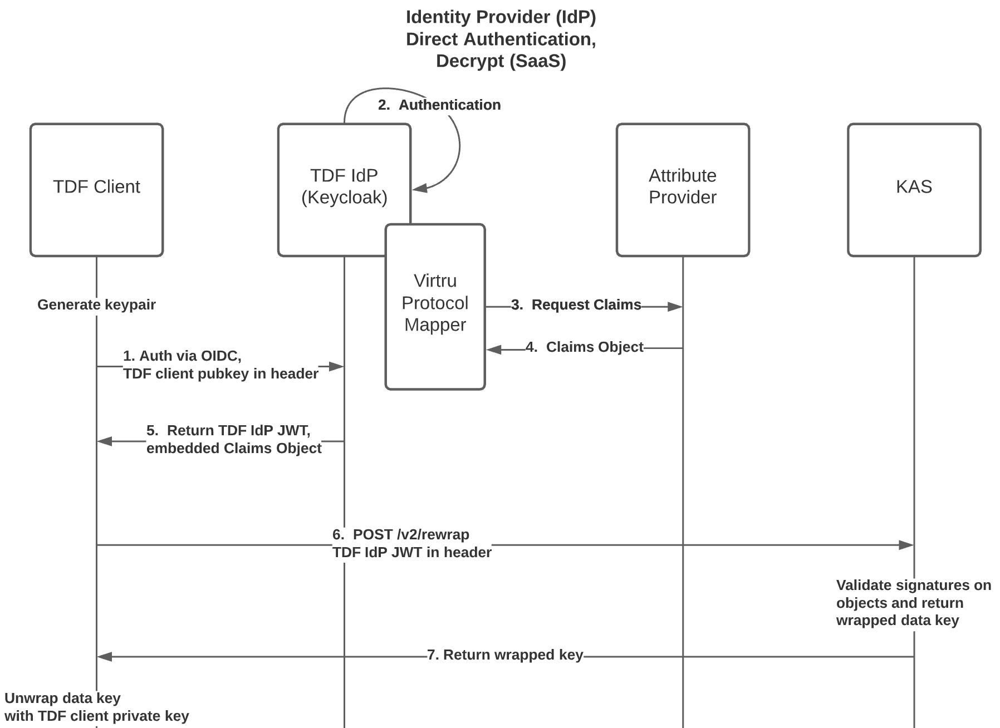
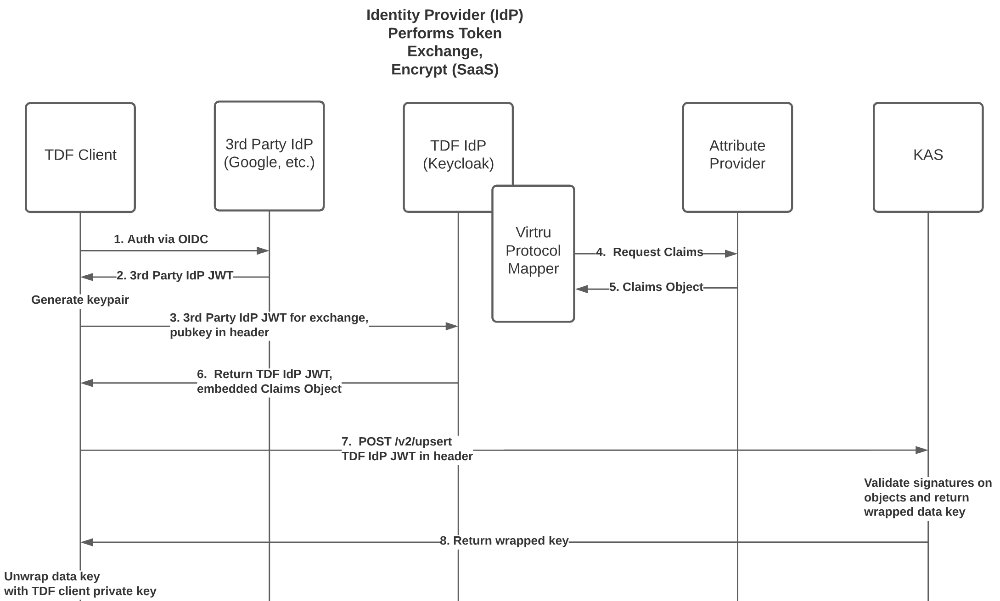
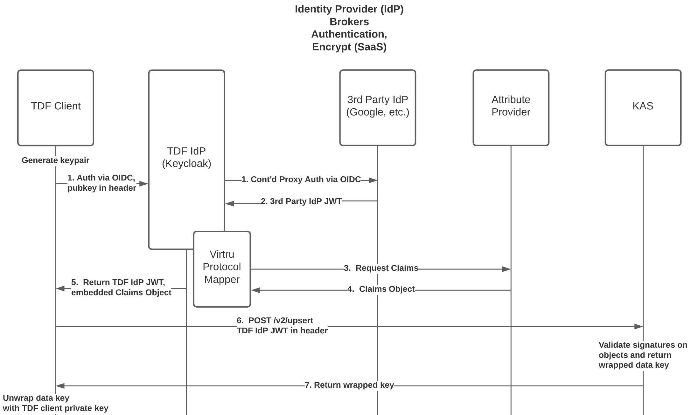

# Protocol

This document describes the canonical system architecture used to encrypt and decrypt TDF ciphertext.

## Architecture

The canonical architecture contains four major components.

* *TDF Client* - Initiates and drives the TDF encryption and decryption workflows. Only component with access to the content (ciphertext or plaintext). 
  * May be entitled as Non-Person Entity acting on behalf of itself, OR on behalf of a Person Entity.
* *OpenID Connect (OIDC) Identity Provider (IdP)* - This system could be any OIDC IdP software.  Virtru has chosen Keycloak as its reference implementation IdP.
  * From Wikipedia:  "Keycloak is an open source software product to allow single sign-on with Identity and Access Management aimed at modern applications and services. As of March 2018 this JBoss community project is under the stewardship of Red Hat.  Keycloak is licensed under Apache 2.0."
  * Any OIDC-compliant IdP software may be used, provided it supports custom claims, and can:
    * Read the TDF Client public key from a custom HTTP header sent with the OIDC authentication request.
    * Construct and send an Attribute Provider web service request, including the public key in the payload.
    * Return the resulting Claims Object in the signed IdP JWT.
  * A list of Certified OpenID Connect applications can be found at:  https://openid.net/developers/certified/
  * *Virtru Protocol Mapper* (PM) is Virtru's Keycloak-specific reference implementation of the above functionality.
* *Attribute Provider* (AP) - A web service that receives requests which contain information about the authenticated entities from an OIDC IdP with custom claims support (ex: Keycloak with Virtru Protocol Mapper), and returns custom TDF OIDC claims in response. It is the responsibility of Attribute Provider to transform incoming 3rd party IdP claims/metadata to a set of outgoing [Attribute Objects](../schema/AttributeObject.md). It returns a TDF [Claims Object](../schema/ClaimsObject.md).
* *Key Access Service* (KAS) - Responsible for authorizing and granting TDF Clients access to rewrapped data key material. If authorized, TDF Clients (on behalf of themselves, or other entities) can use this rewrapped data key to decrypt TDF ciphertext. A valid OIDC token containing [TDF Claims](../schema/ClaimsObject.md) must be used as a bearer token when communicating with KAS. KAS will verify the authenticity of the bearer token, the request signature, and then the policy claims within that bearer token. An otherwise valid and trusted OIDC token without valid TDF Claims will be rejected.

## General Authentication Protocol

OIDC Auth with a PoP scheme is used for **all** TDF Client interactions with backend TDF services:

1. The TDF Client requests an OIDC Bearer Token (either on behalf of itself, or another entity)
by first authenticating via the OpenID Connect (OIDC) Identity Provider (IdP) with Custom Claims
support (in this example, Keycloak). As part of this authentication process, the TDF Client **must** convey its signing public key to the IdP.
    * If the TDF Client public signing key is rotated or changed, a new OIDC Bearer Token must be obtained from the IdP, containing the TDF Client's new public signing key.
    * It should be assumed that the TDF Client's signing keypair is ephemeral, and that the TDF Client's _private_ signing key is known only to the TDF Client.
    * Measures should be taken to protect all TDF Client private keys, but the mechanisms for doing so are outside the scope of this spec.

1. If entity authentication succeeds, a
[TDF Claims Object](../schema/ClaimsObject.md) is obtained from
Attribute Provider and signed by the IdP.  The signing public key previously conveyed by the TDF Client is embedded within the [TDF Claims Object](../schema/ClaimsObject.md).
The signed OIDC Bearer Token is then returned to the TDF Client, containing the complete [TDF Claims Object](../schema/ClaimsObject.md).
    * The [TDF Claims Object](../schema/ClaimsObject.md) contains one or more [Entitlement Objects](EntitlementObject.md) entitling all entities
involved in the authentication request.

1. The TDF Client must convey the IdP-signed OIDC Bearer Token to backend services with all requests, and in addition, the TDF Client **must** sign all requests to backend services with its _private signing key_
    * The request signature should be a signature of the entire request body, sans the request signature itself.
    * For HTTPS, it should be considered best practice to insert the request signature itself in the request body rather than send it as a custom header.

1. Backend services are required to:
    * Validate AuthN:
      * Examine the validity of the OIDC Bearer Token signature by contacting the issuing IdP.
      * Validate that the [TDF Claims Object](../schema/ClaimsObject.md) contains a TDF Client public signing key.
      * Validate that the request signature in the TDF Client's payload **can be validated** with the TDF Client's public signing key embedded in the OIDC Bearer Token associated with the signed request
    * Validate AuthZ (if necessary)
      * Determine if all the entities entitled in the presented bearer token have all the required Attributes for a given operation, as per service requirements.

If these requirements are met, a TDF Client may be considered authenticated and authorized.

### Diagrams

The following sequence diagrams illustrate the TDF Client workflow for encrypting or decrypting TDF ciphertext. The canonical TDF architecture supports two modes of operation: _online mode_ and _offline mode_, which have distinct workflows as shown below.

_Online mode_ is the default mode, where the [wrapped data key](../schema/KeyAccessObject.md) and [authorization policy](../schema/PolicyObject.md) for TDF ciphertext is committed to KAS in-band as part of the `encrypt` operation. This means that the `encrypt` will succeed if and only if all resources are prepared to facilitate an immediate decrypt.

_Offline mode_ requires that the TDF Client previously obtained a
long-lived TDF JWT with embedded Claims Object via
online OIDC authentication.  Or, the TDF Client has otherwise obtained
a valid signed JWT with embedded Claims Object through offline means
(ex: generated by a script using the IdP signing key).  TDF Clients
running in this mode commit the [authorization
policy](../schema/PolicyObject.md) out-of-band, or when decrypt is
first performed. This significantly reduces latency at the cost of a
slightly larger TDF manifest (as the entire wrapped key and policy
information must be included).

### IdP Direct Authentication, Encrypt

### IdP Direct Authentication, Decrypt

### IdP Token Exchange, Encrypt

#### IdP Brokered Authentication, Encrypt

