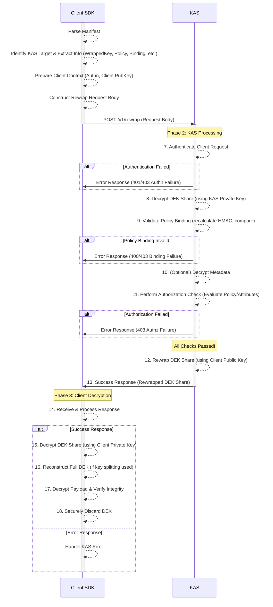

# OpenTDF Protocols

This section describes the interaction protocols between OpenTDF clients (SDKs) and Key Access Servers (KAS) for securely managing access to the Data Encryption Keys (DEKs) used to protect TDF payloads.

## Protocol Selection and Crypto-Agility

A core design principle of OpenTDF is **crypto-agility**. The specific cryptographic algorithms and protocols used for key wrapping and KAS communication are not rigidly fixed by the core TDF structure. Instead, each [Key Access Object](./opentdf/key_access.md) within a TDF's manifest specifies:

1.  The **URL** of the responsible KAS.
2.  The **protocol** identifier (e.g., `wrapped`) indicating how to interact with that KAS.
3.  A **Key Identifier (`kid`)** referencing a specific KAS public key.
4.  A **Split Identifier (`sid`)** uniquely identifying a key share when the DEK is split across multiple KAS instances for multi-party access control

This allows different `keyAccess` objects within the *same* TDF to potentially use different key wrapping mechanisms (e.g., one KAS using RSA, another using ECIES based on Elliptic Curve Cryptography) or evolve independently to adopt new algorithms, such as post-quantum cryptography, without breaking the overall TDF format.

The client SDK MUST interpret the details within a specific `keyAccess` object to determine how to interact with the corresponding KAS.

## General Interaction Flow

While specific protocols vary, the high-level interaction generally follows these phases:

1.  **TDF Creation:** The SDK encrypts the payload with a generated DEK, defines the access policy, wraps the DEK using the target KAS's public key(s) according to the chosen protocol(s), calculates policy bindings, and constructs the manifest.
2.  **Access Request:** A client SDK parses the TDF manifest, identifies the relevant `keyAccess` object(s), and sends a request to the specified KAS URL(s). This request includes the wrapped key(s), policy binding information, the policy itself, and client authentication/authorization context (including the client's public key for rewrapping).
3.  **KAS Verification:** The KAS authenticates the client, decrypts the wrapped DEK share(s) using its private key, validates the policy binding against the provided policy and the decrypted DEK share, and performs the authorization check (evaluating the policy against the client's authenticated attributes).
4.  **Key Rewrap & Response:** If all checks pass, the KAS re-encrypts ("rewraps") the DEK share using the client's public key provided in the request and returns it. If any check fails, the KAS returns an error.
5.  **Payload Decryption:** The client SDK decrypts the rewrapped DEK share(s) using its private key, reconstructs the full DEK (if key splitting was used), and uses the DEK to decrypt the TDF payload, verifying payload integrity simultaneously.

## Example Protocol: RSA Key Wrapping

The [OpenTDF reference implementation (opentdf/platform)](https://github.com/opentdf/platform) demonstrates specific protocols. Below is a detailed example flow using **RSA** for wrapping the DEK. This assumes a scenario with a single KAS for simplicity.

### TDF Creation (Encryption Flow)

*Executed by the OpenTDF Client/SDK*

1.  **Generate DEK:** Generate a cryptographically strong symmetric Data Encryption Key (DEK) (e.g., AES-256).
2.  **Encrypt Payload:** Encrypt the original payload data using the DEK and an authenticated encryption mode (e.g., AES-256-GCM), generating an Initialization Vector (IV) and integrity tags per segment. Store the IV and segment information.
3.  **Define Policy:** Construct the [Policy Object](../schema/OpenTDF/policy.md) JSON defining the required attributes (`dataAttributes`) and optional dissemination list (`dissem`). Base64 encode this JSON string.
4.  **Generate Policy Binding:** Calculate the policy binding hash: `HMAC(DEK, Base64(policyJSON))` using a standard algorithm like HMAC-SHA256. Base64 encode the resulting hash.
5.  **Prepare Optional Metadata:** If client-specific metadata needs to be passed securely to the KAS during decryption, prepare this data.
6.  **Encrypt Optional Metadata:** Encrypt the prepared metadata using the DEK (e.g., AES-GCM). Base64 encode the ciphertext.
7.  **Fetch KAS Public Key:** Obtain the target KAS's RSA public key (identified by the KAS URL and potentially a `kid`). This might involve a separate discovery step or be pre-configured.
8.  **Wrap DEK:** Encrypt the plaintext DEK using the KAS's RSA public key (e.g., using RSAES-OAEP). Base64 encode the resulting ciphertext.
9.  **Construct Key Access Object:** Create the [Key Access Object](../schema/OpenTDF/key_access_object.md) including:
    *   `type`: "wrapped"
    *   `url`: KAS URL
    *   `protocol`: "kas" (or a more specific identifier if needed)
    *   `kid`: Identifier of the KAS key used.
    *   `wrappedKey`: Base64 encoded wrapped DEK from step 8.
    *   `policyBinding`: Object containing `alg` (e.g., "HS256") and the Base64 encoded `hash` from step 4.
    *   `encryptedMetadata`: (Optional) Base64 encoded encrypted metadata from step 6.
10. **Construct Manifest:** Assemble the full `manifest.json` including the `payload`, `encryptionInformation` (containing the `keyAccess` object(s), `method`, `integrityInformation`, and `policy` string), and any `assertions`.
11. **Package TDF:** Create the Zip archive containing `manifest.json` and the encrypted payload file.
12. **Securely Discard DEK:** Erase the plaintext DEK from memory immediately after it has been wrapped and used for metadata encryption/bindings. It should *never* be stored persistently by the encrypting client.

### TDF Access (Decryption Flow)

*Involves interaction between Client/SDK and KAS*

**Phase 1: Client Preparation & Request** *(Executed by SDK)*

1.  **Parse Manifest:** Read the TDF's `manifest.json`.
2.  **Identify KAS Target(s):** Select the appropriate [Key Access Object](./opentdf/key_access.md)(s) based on desired KAS or required key shares (`sid` if splitting).
3.  **Extract Information:** From the selected `keyAccess` object(s), extract the KAS `url`, `wrappedKey`, `policyBinding` object, and optionally `encryptedMetadata`. Extract the Base64 `policy` string from `encryptionInformation`.
4.  **Prepare Client Context:** Obtain the client's authentication credentials (e.g., OAuth token) and the client's public key (corresponding to the private key the client will use for decryption).
5.  **Construct Rewrap Request:** Create a request payload (typically JSON) containing:
    *   The `wrappedKey` to be rewrapped.
    *   The `policyBinding` object (`alg` and `hash`).
    *   The Base64 `policy` string.
    *   (Optional) The `encryptedMetadata`.
    *   The client's public key (for the KAS to rewrap the DEK).
    *   Client authentication/authorization information (e.g., in HTTP headers).
6.  **Send Request:** POST the request payload to the KAS endpoint (e.g., `{KAS_URL}/v1/rewrap`).

**Phase 2: KAS Processing & Verification** *(Executed by KAS)*

7.  **Authenticate Client:** Verify the client's authentication credentials. If invalid, return an authentication error.
8.  **Decrypt DEK Share:** Use the KAS's *private* RSA key (corresponding to the public key used for wrapping, identified by `kid`) to decrypt the `wrappedKey` provided in the request, yielding the plaintext DEK share.
9.  **Validate Policy Binding:**
    *   Recalculate the HMAC: `HMAC(DEK share, policy string from request)` using the algorithm specified in the request's `policyBinding.alg`.
    *   Compare the recalculated HMAC hash with the `policyBinding.hash` provided in the request.
    *   If they do not match, return a policy binding error (indicates tampering or mismatch).
10. **(Optional) Decrypt Metadata:** If `encryptedMetadata` was provided, decrypt it using the plaintext DEK share. This metadata might inform policy decisions or logging.
11. **Perform Authorization Check:**
    *   Retrieve the requesting client's validated attributes/entitlements (based on their authenticated identity).
    *   Parse the `policy` string from the request to get the required `dataAttributes` and `dissem` list.
    *   Evaluate the policy rules (potentially retrieving external Attribute Definitions) against the client's attributes.
    *   Check if the client is in the `dissem` list (if applicable).
    *   If authorization fails (policy requirements not met), return an authorization error.
12. **Rewrap DEK Share:** If all checks pass, encrypt the plaintext DEK share using the client's public key provided in the request (e.g., using RSAES-OAEP if the client key is RSA). Base64 encode the result.
13. **Send Response:** Return a success response containing the Base64 encoded, rewrapped DEK share.

**Phase 3: Client Decryption** *(Executed by SDK)*

14. **Receive Response:** Get the response from the KAS. Check for errors (authentication, binding, authorization failures).
15. **Decrypt DEK Share:** If the request was successful, use the client's *private* key to decrypt the rewrapped DEK share received from the KAS.
16. **(If Key Splitting) Reconstruct DEK:** If multiple shares were required (`sid` was used), combine the decrypted shares (e.g., via XOR) to reconstruct the full plaintext DEK.
17. **Decrypt Payload:** Use the plaintext DEK and the parameters from `encryptionInformation.method` (IV) to decrypt the TDF payload. During decryption (especially with AES-GCM or streaming), simultaneously verify the integrity of each segment using the `hash` from the [Segment Object](./opentdf/segment.md) and finally verify the `rootSignature` from [`integrityInformation`](./opentdf/integrity_information.md). If any integrity check fails, abort decryption and report an error.
18. **Securely Discard DEK:** Once the payload is decrypted or decryption fails, securely erase the plaintext DEK and any intermediate shares from memory.

## Error Handling

KAS implementations SHOULD return standard HTTP error codes and informative error messages (without revealing sensitive internal state) for failed requests, clearly distinguishing between:

*   Authentication failures (401/403)
*   Policy Binding validation failures (e.g., 400 Bad Request or 403 Forbidden)
*   Authorization failures (policy denied) (403 Forbidden)
*   Invalid input or malformed requests (400 Bad Request)
*   Internal server errors (500)

Clients MUST handle these errors appropriately.