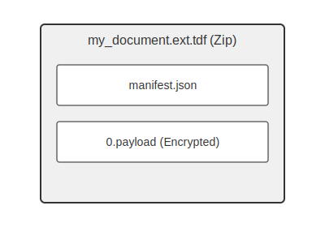

# OpenTDF Specification Overview

This section details the **OpenTDF** format, the primary specification for general-purpose Trusted Data Format (TDF) implementations. It utilizes a JSON-based manifest packaged with the encrypted payload within a standard Zip archive.

## Core Concepts

Before diving into specific object definitions, understand these core OpenTDF concepts:

*   **Security:** Learn about what makes OpenTDF secure. See [Security Concepts](../../concepts/security.md).
*   **Key Access and Wrapping:** How access control is defined using ABAC. See [Access Control](../../concepts/access_control.md).

## Format Structure

An OpenTDF file is a Zip archive, typically using the `.tdf` extension (e.g., `document.pdf.tdf`). It MUST contain the following components:

1.  **`manifest.json`:** A JSON file containing all metadata required for decryption and access control. This is the core of the TDF structure.
2.  **`payload`:** The encrypted original data. The filename within the archive is referenced by the `manifest.json` (commonly `0.payload`).

## Key Components of `manifest.json`

The `manifest.json` file orchestrates the TDF. Its main sections are:

*   **Payload Description:** Information about the encrypted payload (type, reference, protocol, encryption status). See [Payload Object](./payload.md).
*   **Encryption Information:** Details on how the payload was encrypted, how to access the key, integrity checks, and the access policy. See [Encryption Information](./encryption_information.md). This includes:
    *   [Key Access Objects](./key_access_object.md): How and where to get the decryption key.
    *   [Method](./method.md): Symmetric encryption algorithm details.
    *   [Integrity Information](./integrity_information.md): Hashes/signatures for payload integrity.
    *   [Policy](./policy.md): The access control policy (embedded as a Base64 string).
*   **Assertions:** Optional, verifiable statements about the TDF or payload. See [Assertions](./assertion.md).

## Manifest Schema

Use the links below to explore the detailed structure of each component:

*   [**Manifest Structure (`manifest.json`)**](./manifest.md)
*   [Payload Object](./payload.md)
*   [Encryption Information Object](./encryption_information.md)
    *   [Key Access Object](./key_access_object.md)
    *   [Method Object](./method.md)
    *   [Integrity Information Object](./integrity_information.md)
    *   [Segment Object](./segment.md)
*   [Assertions](./assertion.md)
    *   [Statement Object](./assertion_statement.md)
    *   [Binding Object](./assertion_binding.md)
*   [**Conceptual Guides:**](./)
    *   [Security](../../concepts/security.md) 
    *   [Access Control](../../concepts/access_control.md)

