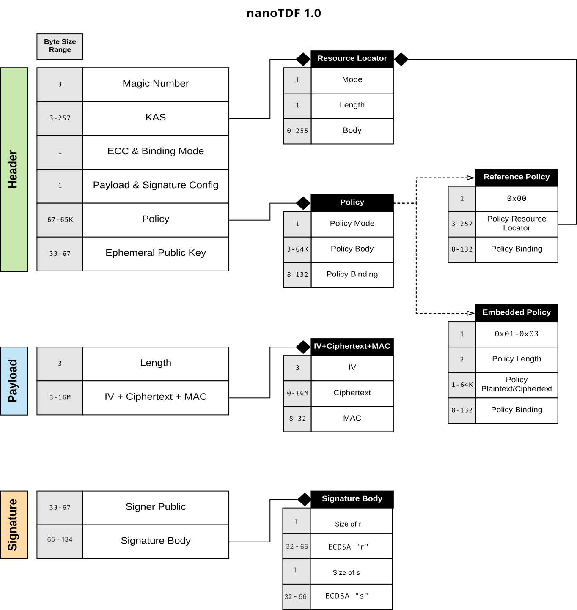
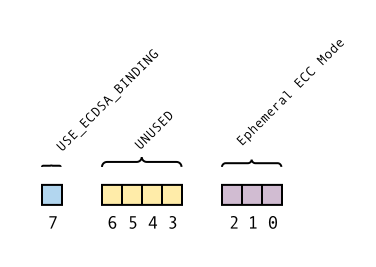
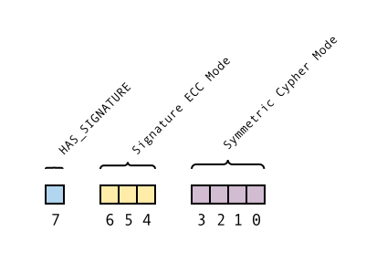

# NanoTDF

This document describes NanoTDF version v1, a compact binary data encoding format.

## 1. Problem

The Base TDF allows for the description of sophisticated encryption processes.
However, the descriptive and sometimes verbose nature of the Base TDF prevents
it's use in environments with constrained storage or bandwidth requirements. In
order to support these use-cases, NanoTDF has been designed as a binary format
with strict constraints and without sacrificing many of the descriptive
capabilities of the Base TDF. The minimum overhead of this format is less than 200
bytes. 

## 2. Background

### 2.1 ECC Encryption/Decryption

All of the encryption methods used in the NanoTDF involve Elliptic Curve
Cryptography (ECC). Unlike when using RSA, ECC public/private key pairs are only
used to create signatures or to handle key exchange. The ECC property in use
by the NanoTDF is the support of a secure key exchange scheme, ECDH. Given
either the recipients private key and the sender's public key or the sender's
private key and the recipient public key, the same key can be generated and used
securely. The combination of public/private key allows derivation of a
deterministic point on an elliptic curve. That point, when used with a Key
Derivation Function (KDF), generates an encryption key to share secrets.
Variations of this method are used by SMIME, GPG, and ECIES. Section 4 details
more information on the encryption method used. 

For reference please see the following resources:

* https://cryptobook.nakov.com/asymmetric-key-ciphers/ecc-encryption-decryption
* https://tools.ietf.org/html/draft-ietf-smime-3278bis-09
* https://tools.ietf.org/html/rfc6637

## 3. Design

NanoTDF is a binary structure that allows for offline creation of small
encrypted payloads. Where possible, the design attempts to provide quickly
deserializable chunks of data. However, the design is mostly concerned with
maintaining the smallest possible size.

### 3.1 Assumptions

* Elliptic Curve Cryptography is used with ECDH + HKDF to derive a key
* No Elliptic Curves less than 256-bits are supported
* All numbers are big endian

### 3.2 Features

The initial version was designed to accomodate the following requirements:

* A single policy
* A small payload that can fit within 240 Bytes
* Offline creation

### 3.3 Structure

NanoTDF is composed of 3 main sections: the Header, the Payload, and the
Signature. The following table describes the overall binary structure of the
nanotdf. Each section is described in greater detail in the subsequent sections
and a high level diagram is present after the table below.

| Section              | Minimum Length (B)  | Maximum Length (B)  |
|----------------------|---------------------|---------------------|
| Header               | 43                  | 584                 |
| Payload              | 14                  | 16,777,218          |
| Signature (Optional) | 97                  | 133                 |

The following diagram is the general overview of the NanoTDF structure:



#### 3.3.1 Header

The header section is intended to be sent to a KAS and is used by the KAS to
derive the decryption key that can decrypts the NanoTDF payload. The Header is
structured as follows:

| Section                | Minimum Length (B)  | Maximum Length (B)  |
|------------------------|---------------------|---------------------|
| Magic Number + Version | 3                   | 3                   |
| KAS                    | 3                   | 257                 |
| ECC Mode               | 1                   | 1                   |
| Payload + Sig Mode     | 1                   | 1                   |
| Policy                 | 3                   | 257                 |
| Ephemeral Key          | 33                  | 67                  |

##### 3.3.1.1 Magic Number + Version

The Magic Number + Version is a 3 byte artifact that can be used to aid in the
discovery of a NanoTDF. The Magic Number is the first 18 bits of this section.
The remaining 6 bits are used for the version number. The 18 bits of the magic
number are (`x`'s represent the space for the version number): 

```
0100 1100 0011 0001 01xx xxxx
``` 

However, as part of an easter egg of the design, we have started the version
count at 12, all versions before that should be considered invalid. The first
version of the NanoTDF has a Magic Number + Version value of `L1L` which,
consequently, is `TDFM` (think TDF mini/micro/etc) when base64 encoded. 

##### 3.3.1.2 KAS

This section contains a Resource Locator type that allows describing access to a
resource. In the case of the KAS, the Resource Locator defines how to access a
KAS and its key. The Key Identifier (KID) uses the Protocol Enum w/Identifier.
Protocol Enum w/Identifier is required.

Refer to the Resource Locator object's definition in [Section 3.4.1].

##### 3.3.1.3 ECC And Binding Mode

[ECC And Binding Mode]: #3313-ecc-and-binding-mode
[Section 3.3.1.3]: #3313-ecc-and-binding-mode

This section contains a 1-byte bitfield describing the ECC Params and Policy
binding strategy to use. The Policy Binding strategy is either using a 64-bit
GMAC (using AES-256-GCM) tag or an ECDSA signature. The signature size depends
on the size of ECC Params used. NanoTDF at this time only supports methods
that involve Elliptic Curve Cryptography. The fields are structured as follows:

| Section                   | Bit Length  | Bit start index |
|---------------------------|-------------|-----------------|
| `USE_ECDSA_BINDING`       | 1           | 7               |
| `UNUSED`                  | 4           | 3               |
| Ephemeral ECC Params Enum | 3           | 0               |



###### 3.3.1.3.1 `USE_ECDSA_BINDING`

The policy mode is a flag that chooses between one of two options. If set to `0`
then a 64-bit GMAC tag is used to bind the payload's key to the policy. If set
to `1` an ECDSA signature is used. 

###### 3.3.1.3.2 Ephemeral ECC Params Enum

This 7-bit length enum describes the possible ECC Parameters to use. By design,
NanoTDF does not allow choosing arbitrary ECC params. The following table
describes the valid values and the associated ECC Params.

| Value   | Params             |
|---------|--------------------|
| `0x00`  | `secp256r1`        |
| `0x01`  | `secp384r1`        |
| `0x02`  | `secp521r1`        |
| `0x03`  | `secp256k1`        |

##### 3.3.1.4 Symmetric and Payload Config

[Symmetric and Payload Config]: #3314-symmetric-and-payload-config
[Section 3.3.1.4]: #3314-symmetric-and-payload-config

This section contains a 1 byte data structure composed of bitfields that
describe the symmetric ciphers for encrypted payloads. This cipher applies to
both the Payload and the Policy of the NanoTDF. The fields are as follows:

| Section               | Bit Length  | Bit start index |
|-----------------------|-------------|-----------------|
| `HAS_SIGNATURE`       | 1           | 7               |
| Signature ECC Mode    | 3           | 4               |
| Symmetric Cipher Enum | 4           | 0               |



###### 3.3.1.4.1 `HAS_SIGNATURE`

This bit flag is set to `1` if a signature is to be used with the payload and
zero otherwise.

###### 3.3.1.4.2 Signature ECC Mode

[Section 3.3.1.4.2]: #33142-signature-ecc-mode

The Signature ECC Mode is used to determine the length of the signature at the
end of a NanoTDF. This, in combination with the previous `HAS_SIGNATURE`
section, describe the signature of the NanoTDF. The following table
describes the valid values and the associated ECC Params.

| Value   | Params             |
|---------|--------------------|
| `0x00`  | `secp256r1`        |
| `0x01`  | `secp384r1`        |
| `0x02`  | `secp521r1`        |
| `0x03`  | `secp256k1`        |

###### 3.3.1.4.3 Symmetric Cipher Enum

The symmetric cipher enum is an enum of available symmetric ciphers to use for
encrypting the payload and/or the policy (if the policy is encrypted). The
possible values are as follows:

| Value   | Protocol                  |
|---------|---------------------------|
| `0x00`  | AES-256-GCM+64-bit-tag    |
| `0x01`  | AES-256-GCM+96-bit-tag    |
| `0x02`  | AES-256-GCM+104-bit-tag   |
| `0x03`  | AES-256-GCM+112-bit-tag   |
| `0x04`  | AES-256-GCM+120-bit-tag   |
| `0x05`  | AES-256-GCM+128-bit-tag   |

_Note: This table may be extended in a future point release_

##### 3.3.1.5 Policy

This section contains a Policy object. The data contained in the Policy allows
for definition flexible definitions of a policy including a policy by reference,
or an embedded policy. Refer to the Policy object's definition in [Section
3.4.2]

##### 3.3.1.6 Key

This section contains a Key object. The size of the key is determined by the
Encryption Method Section. This section contains an ephemeral public key.

#### 3.3.2 Payload

The payload section of contains the ciphertext that is protected by
the policy defined in the Header. The structure of the Payload is as follows:

| Section               | Minimum Length (B)  | Maximum Length (B)  |
|-----------------------|---------------------|---------------------|
| Length                | 3                   | 3                   |
| IV + Ciphertext + MAC | 11                  | 16777215            |

##### 3.3.2.1 Length

[Section 3.3.2.1]: #3321-length

This 3 byte unsigned integer dictates the length of the subsequent ciphertext
section.

##### 3.3.2.2 IV + Ciphertext + MAC

This section's length is determined by the Length section in [Section 3.3.2.1]
that immediately precedes this section. However, this section has the following
structure:

| Section               | Minimum Length (B)  | Maximum Length (B)  |
|-----------------------|---------------------|---------------------|
| IV                    | 3                   | 3                   |
| Ciphertext            | 0                   | 16777204            |
| Payload MAC           | 8                   | 32                  |

###### 3.3.2.2.1 IV

The IV used for encryption. This value is a byte array containing the IV. This
IV must never be reused with the same symmetric key. Also, to support an
extremely compact version the IV value `00 00 00` is reserved
for use with an encrypted policy.

###### 3.3.2.2.2 Ciphertext

The byte array of the ciphertext that is protected in the NanoTDF. The
encryption method used to create or decrypt the ciphertext is defined in the Key
Access object in the header.

###### 3.3.2.2.3 Payload MAC

The MAC of the payload. The Size of this MAC is determined by the Encryption
Method Enum used in the [Symmetric and Payload Config] object in the header.

#### 3.3.3 Signature

The signature section is an optional section that contains an ECDSA signature
used to cryptographically bind the Header and Payload to a creator of the
NanoTDF file. The key used for signing is the private key of the creator.
The ECC Params used for the signature are described in [Section 3.3.1.4.2]. 
The private key used for this signature is distinctly different than
the ephemeral private key. This is a persistent key belonging to an individual,
entity, or device. The signature is used to authenticate
the entire NanoTDF and contains both the public key related to the creators
private key and the resulting signature. The structure of this section:

| Section       | Minimum Length (B)  | Maximum Length (B)  |
|---------------|---------------------|---------------------|
| Public Key    | 33                  | 67                  |
| Signature     | 64                  | 132                 |

##### 3.3.3.1 Public Key

This section contains the compressed public key of the private key used to sign
the message.

##### 3.3.3.2 Signature

This section contains the encoded `r` and `s` values of the ECDSA signature.
They are encoded as described in [Section 5.2].

### 3.4 Types

This section describes embedded types that are used in multiple places in a
NanoTDF file.

#### 3.4.1 Resource Locator

[Resource Locator]: #341-resource-locator
[Section 3.4.1]: #341-resource-locator

The Resource Locator is a way for the NanoTDF to represent references to
external resources in as succinct a format as possible. 

| Section               | Minimum Length (B)  | Maximum Length (B)  |
|-----------------------|---------------------|---------------------|
| Protocol Enum         | 1                   | 1                   |
| Body Length           | 1                   | 1                   |
| Body                  | 1                   | 255                 |
| Identifier (optional) | 0                   | 32                  |

##### 3.4.1.1 Protocol Header

[Section 3.4.1.1]: #3411-protocol-enum
[Protocol Enum]: #3411-protocol-enum

This is a single byte used to describe the protocol used to locate a resource. 
The following are the available values:

| Value      | Protocol                    |
|------------|-----------------------------|
| Bits 3-0   | Protocol Enum Value         |
| `0x0`      | `http`                      |
| `0x1`      | `https`                     |
| `0x2`      | unreserved                  |
| `0xf`      | Shared Resource Directory   |

| Value      | Identifier                                               |
|------------|----------------------------------------------------------|
| Bits 7-4   | Used for lookups of KAS key, Remote Policy, Policy key   |
| `0x0`      | None                                                     |
| `0x1`      | 2 Byte                                                   |
| `0x2`      | 8 Byte                                                   |
| `0x3`      | 32 Byte                                                  |

_Note: Any unlisted values are unreserved. Clients should consider their use
an erroneous condition._

###### 3.4.1.1.1 The Shared Resource Directory

One special thing to note about the protocol enum is the Shared Directory
version. This allows users of a shared directory to have reduced sizes
of their NanoTDF. The shared resource directory at this time is still an
experimental part of the NanoTDF specification and is included in the documentation to support
a minor update to the NanoTDF in a subsequent update to the specification. 

Note is this specification version ( > `opentdf/spec` 4.3.0) the "Shared Resource Directory" flag has moved.

##### 3.4.1.2 Body Length

The length of the Body that describes how to retrieve the Resource referenced by
the Resource Locator.

##### 3.4.1.3 Body

The data required to retrieve the Resource referenced by the Resource Locator.
The type of the data contained in the Body is determined by the [Protocol Enum]. For `http` or `https` the data contained in this
section would be everything following the `://` in a URL.

#### 3.4.2 Policy

[Policy]: #342-policy
[Section 3.4.2]: #342-policy

The structure of the Policy is as follows:

| Section       | Minimum Length (B)  | Maximum Length (B)  |
|---------------|---------------------|---------------------|
| Type Enum     | 1                   | 1                   |
| Body          | 3                   | 257                 |
| Binding       | 8                   | 132                 |

##### 3.4.2.1 Type Enum

The Type Enum is used to determine the expected content of the Policy Body that
the Policy Section contains.

The values for Type Enum are as follows:

| Value   | Policy Body                                       |
|---------|---------------------------------------------------|
| `0x00`  | Remote Policy                                     |
| `0x01`  | Embedded Policy (Plaintext)                       |
| `0x02`  | Embedded Policy (Encrypted)                       |
| `0x03`  | Embedded Policy (Encrypted w/[Policy Key Access]) |

##### 3.4.2.3 Body

The Policy's Body Section has a structure that is dependent on the Type Enum
value used in the Policy Section. 

###### 3.4.2.3.1 Body for Remote Policy

If the policy type is set to use a Remote Policy, then the Resource Locator
object described in [Section 3.4.1] is used to describe the remote policy.

###### 3.4.2.3.2 Body for Embedded Policy

These policy types allow for creation and binding of arbitraty policies. 

| Section                       | Minimum Length (B) | Maximum Length (B)  |
|-------------------------------|--------------------|---------------------|
| Content Length                | 2                  | 2                   |
| Plaintext/Ciphertext          | 1                  | 255                 |
| (Optional) Policy Key Access  | 36                 | 136                 |

###### 3.4.2.3.2.1 Content Length

This describes the length of the Plaintext/Ciphertext used to define the policy.

###### 3.4.2.3.2.2 Plaintext / Ciphertext

The plaintext or the ciphertext of the embedded policy. Please note that an IV
section is missing for the encrypted policy. To save space, the IV used for an
encrypted policy is always `0x000000`. This IV and key combination should not be
reused.

###### 3.4.2.3.2.3 (Optional) Policy Key Access

[Policy Key Access]: #342323-optional-policy-key-access
[Section 3.4.2.3.2.3]: #342323-optional-policy-key-access

This section allows for an ephemeral key other than the Payload key to encrypt
the policy. However, for speed's sake, it is suggested that this only be used if
the file's encrypted payload is encrypted for a KAS's HSM. 

The structure of this section is as follows:

| Section                | Minimum Length (B) | Maximum Length (B)  |
|------------------------|--------------------|---------------------|
| Resource Locator       | 3                  | 257                 |
| Ephemeral Public Key   | 33                 | 133                 |

###### 3.4.2.3.2.3.1 Resource Locator

This is the resource locator to reference the remote public key used in
conjunction with an ephemeral public key to generate a symmetric key that
encrypts the policy.

###### 3.4.2.3.2.3.2 Ephemeral Public Key

This contains the Ephemeral Public Key. The size of the public key is determined
by the the ECC Mode.

##### 3.4.2.4 Binding

The Binding section contains a cryptographic binding of the payload key to the
policy. The type of the binding is either a 64-bit GMAC or an ECDSA signature.
The binding type is determined by the [ECC And Binding Mode] Section.

In order to create the binding the following equation is used:

```
BM = Binding method (either ECDSA or a GMAC)
BS = Binding Signature
PB = Policy Body Bytes
BS = BM(SHA256(PB))
```

If the Binding method is ECC, then ECDSA is used. If the binding method is GMAC
then the key derived from the Ephemeral Public Key is used to encrypt the policy
and payload together and generate the GMAC tag. For key derivation details see
[Section 4].

## 4. ECC Encryption Key Derivation

[Section 4]: #4-ecc-encryption-key-derivation

Encrypting information with NanoTDF is done by using ECDH to derive a key.
However, once the shared key is derived, we must generate a key of the
appropriate size as the ECDH bytes may derive a key with a length longer (or
shorter) than the symmetric encryption algorithm expects. To decouple the
symmetric encryption method and the ECC mode, we will use HKDF as a Key
Derivation Function with the following parameters:

* `size` - Depends on the key size used for symmetric encryption
* `hash method` - This should use `SHA256`
* `salt` - This is a non-random value tied to the magic number and version
  `SHA256(MAGIC_NUMBER + VERSION)`. For this version of NanoTDF the value
  of the salt is
  `3de3ca1e50cf62d8b6aba603a96fca6761387a7ac86c3d3afe85ae2d1812edfc` in hex.
* `info` - This should be an empty value.

## 5. Encodings

### 5.1 ECC Public Key Encoding

ECC Public Keys should be encoded as compressed key format. This should follow
the X9.62 ECC Public Key Compressed Encoding format. 
<!-- todo find a good link -->

### 5.2 ECDSA Signature Encoding

[Section 5.2]: #52-ecdsa-signature-encoding

ECDSA signatures are big endian encodings of the `r` and `s` values of an ECDSA
signature. The length of `r` and `s` values is determined by the ECC Mode used
for the signature. The encoding for the signature is the big endian encodings of
R and S concatenated to each other. For example, `r = 1` and `s = 2` for an
ECDSA signature of a secp256k1 key would be (line breaks and spaces are added
for easier visualization):

```
00 00 00 00 00 00 00 00 00 00 00 00 00 00 00 00 
00 00 00 00 00 00 00 00 00 00 00 00 00 00 00 01
00 00 00 00 00 00 00 00 00 00 00 00 00 00 00 00 
00 00 00 00 00 00 00 00 00 00 00 00 00 00 00 02
```

## 6. Examples

### 6.1 Basic Example

#### 6.1.1 Parameters


This example that has the following parameters:

* It following urls for a kas and policy
  * KAS URL: `http://localhost:65432/kas`
  * Policy URL: `http://localhost:65432/kas/policy`
* ECC Mode
  * `use_ecdsa_binding` is `True`
  * ECC Params is 0x00 (for `secp256r1`)
* [Symmetric and Payload Config]
  * `has_signature` is `True`
  * Mode is `0x00` for AES256GCM with a 64-bit tag
* Payload
  * The plaintext payload is `DON'T`. _This is a little easter egg. This was the
    message sent in the first TDF email sent with the browser extension on
    Gmail._


#### 6.1.2 Creator's DER encoded Private Key (base64)

_This is included to allow verification of the example._

```
MIGHAgEAMBMGByqGSM49AgEGCCqGSM49AwEHBG0wawIBAQQgcal1YrV0QohnYoBBlcBLrRETfJlqFOkG
LSmUOKizW0KhRANCAATVz7l/VSTFkD9ic2IFkzaqcaTC7hbQW3g0A5firgcdLv4sj0OJHZ5zf8U0oUiy
IrwNU28ahFSfjCTYvzw/bvPg
```


#### 6.1.3 Recipient DER encoded Private Key (base64)

_This is included to allow verification of the example._

```
MIGHAgEAMBMGByqGSM49AgEGCCqGSM49AwEHBG0wawIBAQQgRywXmrI1J07LZni8xaoKhXj8WbdDHdjd
N62+tgxjdhihRANCAARon4RjqRNA40eEdBT172emATq3I2siKccLcXl07nTrbAu4enVDo9T4LfQ4eZ0y
x/KkIX2HylxzkAEoBxzVpBLN
```


#### 6.1.4 Recipient Compressed Public Key


```
A2ifhGOpE0DjR4R0FPXvZ6YBOrcjayIpxwtxeXTudOts
```


#### 6.1.5 NanoTDF

(Base64)

```
TDFMAQ5rYXMudmlydHJ1LmNvbYCAAAEVa2FzLnZpcnRydS5jb20vcG9saWN5teQTpgIR5fF7IjSgzT82
/3u6bY/o3yP2LJ0JNW+FgvipzxUSbIqdpGxeTgy8yCaXGawFG4BiXMdUAwNv+4KHHwL3f7rlJgnaxejr
94bhG3rt1w+JgPlIDH5nHLqrjiRQkgAAEJ69CRdSJo4D+f2AFK98ywYC1c+5f1UkxZA/YnNiBZM2qnGk
wu4W0Ft4NAOX4q4HHS6dm4rjMO9wI+pWmbUgS7x9Vo3/+j/6U1fh/NKQ8xrR72LORvDZXfQxa8rzco1P
dc0VlQEL8gQgdKyU3il2ugLz
```

(Hex)

```
4c 31 4c 01 0e 6b 61 73 2e 76 69 72 74 72 75 2e 63 6f 6d 80
80 00 01 15 6b 61 73 2e 76 69 72 74 72 75 2e 63 6f 6d 2f 70
6f 6c 69 63 79 b5 e4 13 a6 02 11 e5 f1 7b 22 34 a0 cd 3f 36
ff 7b ba 6d 8f e8 df 23 f6 2c 9d 09 35 6f 85 82 f8 a9 cf 15
12 6c 8a 9d a4 6c 5e 4e 0c bc c8 26 97 19 ac 05 1b 80 62 5c
c7 54 03 03 6f fb 82 87 1f 02 f7 7f ba e5 26 09 da c5 e8 eb
f7 86 e1 1b 7a ed d7 0f 89 80 f9 48 0c 7e 67 1c ba ab 8e 24
50 92 00 00 10 9e bd 09 17 52 26 8e 03 f9 fd 80 14 af 7c cb
06 02 d5 cf b9 7f 55 24 c5 90 3f 62 73 62 05 93 36 aa 71 a4
c2 ee 16 d0 5b 78 34 03 97 e2 ae 07 1d 2e 9d 9b 8a e3 30 ef
70 23 ea 56 99 b5 20 4b bc 7d 56 8d ff fa 3f fa 53 57 e1 fc
d2 90 f3 1a d1 ef 62 ce 46 f0 d9 5d f4 31 6b ca f3 72 8d 4f
75 cd 15 95 01 0b f2 04 20 74 ac 94 de 29 76 ba 02 f3
```


#### 6.1.6 Expected Parsing Results

The following sections contain each section as they should be parsed within an
implementing library. If explanation is needed, it describes what specific
fields might mean.

##### 6.1.6.1 Header


###### 6.1.6.1.1 Magic Number + Version


```
4c 31 4c
```


###### 6.1.6.1.2 KAS


```
01 0e 6b 61 73 2e 76 69 72 74 72 75 2e 63 6f 6d
```


###### 6.1.6.1.3 ECC and Binding Mode


```
80
```


###### 6.1.6.1.4 Symmetric and Payload Config


```
80
```


###### 6.1.6.1.5 Policy


###### 6.1.6.1.5.1 Body


```
01 15 6b 61 73 2e 76 69 72 74 72 75 2e 63 6f 6d 2f 70 6f 6c
69 63 79
```


###### 6.1.6.1.5.2 Binding


```
b5 e4 13 a6 02 11 e5 f1 7b 22 34 a0 cd 3f 36 ff 7b ba 6d 8f
e8 df 23 f6 2c 9d 09 35 6f 85 82 f8 a9 cf 15 12 6c 8a 9d a4
6c 5e 4e 0c bc c8 26 97 19 ac 05 1b 80 62 5c c7 54 03 03 6f
fb 82 87 1f
```


###### 6.1.6.1.6 Ephemeral Key


```
02 f7 7f ba e5 26 09 da c5 e8 eb f7 86 e1 1b 7a ed d7 0f 89
80 f9 48 0c 7e 67 1c ba ab 8e 24 50 92
```


###### 6.1.6.1.7 Payload


###### 6.1.6.1.7.1 IV


```
9e bd 09
```


###### 6.1.6.1.7.2 Ciphertext


```
17 52 26 8e 03
```


###### 6.1.6.1.7.3 Auth Tag


```
f9 fd 80 14 af 7c cb 06
```


###### 6.1.6.1.8 Signature


###### 6.1.6.1.8.1 Public Key

_This is the public key that belongs to the creator of this nanotdf._

```
02 d5 cf b9 7f 55 24 c5 90 3f 62 73 62 05 93 36 aa 71 a4 c2
ee 16 d0 5b 78 34 03 97 e2 ae 07 1d 2e
```


###### 6.1.6.1.8.2 Body (R, S)


```
9d 9b 8a e3 30 ef 70 23 ea 56 99 b5 20 4b bc 7d 56 8d ff fa
3f fa 53 57 e1 fc d2 90 f3 1a d1 ef 62 ce 46 f0 d9 5d f4 31
6b ca f3 72 8d 4f 75 cd 15 95 01 0b f2 04 20 74 ac 94 de 29
76 ba 02 f3
```

### 6.2 No Signature Example

#### 6.2.1 Parameters


This example that has the following parameters:

* It following urls for a kas and policy
  * KAS URL: `https://kas.example.com`
  * Policy URL: `https://kas.example.com/policy/abcdef`
* ECC Mode
  * `use_ecdsa_binding` is `True`
  * ECC Params is 0x00 (for `secp256r1`)
* [Symmetric and Payload Config]
  * `has_signature` is `False`
  * Mode is `0x05` for AES256GCM with a 128-bit tag
* Payload
  * The plaintext payload is `Keep this message secret`. 


#### 6.2.2 nanotdf Creator's DER encoded Private Key (base64)

As no signature is included in this nanotdf, there is no private key included
for the creator

#### 6.2.3 Recipient DER encoded Private Key (base64)

_This is included to allow verification of the example._

```
MIGHAgEAMBMGByqGSM49AgEGCCqGSM49AwEHBG0wawIBAQQgWmLjd6gDd2rwU48m2vVsDfVJ6fKCYt4y
ZA8kSu9O3hehRANCAAQwmFsrcVyKJpSQBMVVrIZ0v0XIin+BSdS/ENvcyIc2YKKIK43zkpPR13ibjsy1
UhZJItQFlBChYCFDPUkANqcs
```


#### 6.2.4 Recipient Compressed Public Key


```
AjCYWytxXIomlJAExVWshnS/RciKf4FJ1L8Q29zIhzZg
```


#### 6.2.5 NanoTDF

(Base64)

```
TDFMAQ9rYXMuZXhhbXBsZS5jb22ANQABHWthcy5leGFtcGxlLmNvbS9wb2xpY3kvYWJjZGVmYaoGjXbC
DfOlY3YzmGKfUjBy0IbUTUvmbiV04TvDLMcCKkzceqfvy6YDwZg/h3LvHRDoLg1ABvS93ZJ4eTVmcwPo
sz9EmnOSdxPUpKK05elFLi8FNDOdNZEb36Fe4Ys62wAAK1DknPqraRhSJhstY2CDGsvV8gP77xf5Rr7+
x57lEZugkjM7LA7qy54vjcg=
```

(Hex)

```
4c 31 4c 01 0f 6b 61 73 2e 65 78 61 6d 70 6c 65 2e 63 6f 6d
80 35 00 01 1d 6b 61 73 2e 65 78 61 6d 70 6c 65 2e 63 6f 6d
2f 70 6f 6c 69 63 79 2f 61 62 63 64 65 66 61 aa 06 8d 76 c2
0d f3 a5 63 76 33 98 62 9f 52 30 72 d0 86 d4 4d 4b e6 6e 25
74 e1 3b c3 2c c7 02 2a 4c dc 7a a7 ef cb a6 03 c1 98 3f 87
72 ef 1d 10 e8 2e 0d 40 06 f4 bd dd 92 78 79 35 66 73 03 e8
b3 3f 44 9a 73 92 77 13 d4 a4 a2 b4 e5 e9 45 2e 2f 05 34 33
9d 35 91 1b df a1 5e e1 8b 3a db 00 00 2b 50 e4 9c fa ab 69
18 52 26 1b 2d 63 60 83 1a cb d5 f2 03 fb ef 17 f9 46 be fe
c7 9e e5 11 9b a0 92 33 3b 2c 0e ea cb 9e 2f 8d c8
```


#### 6.2.6 Expected Parsing Results

The following sections contain each section as they should be parsed within an
implementing library. If explanation is needed, it describes what specific
fields might mean.

##### 6.2.6.1 Header


###### 6.2.6.1.1 Magic Number + Version


```
4c 31 4c
```


###### 6.2.6.1.2 KAS


```
01 0f 6b 61 73 2e 65 78 61 6d 70 6c 65 2e 63 6f 6d
```


###### 6.2.6.1.3 ECC and Binding Mode


```
80
```


###### 6.2.6.1.4 Symmetric and Payload Config


```
35
```


###### 6.2.6.1.5 Policy


###### 6.2.6.1.5.1 Body


```
01 1d 6b 61 73 2e 65 78 61 6d 70 6c 65 2e 63 6f 6d 2f 70 6f
6c 69 63 79 2f 61 62 63 64 65 66
```


###### 6.2.6.1.5.2 Binding


```
61 aa 06 8d 76 c2 0d f3 a5 63 76 33 98 62 9f 52 30 72 d0 86
d4 4d 4b e6 6e 25 74 e1 3b c3 2c c7 02 2a 4c dc 7a a7 ef cb
a6 03 c1 98 3f 87 72 ef 1d 10 e8 2e 0d 40 06 f4 bd dd 92 78
79 35 66 73
```


###### 6.2.6.1.6 Ephemeral Key


```
03 e8 b3 3f 44 9a 73 92 77 13 d4 a4 a2 b4 e5 e9 45 2e 2f 05
34 33 9d 35 91 1b df a1 5e e1 8b 3a db
```


###### 6.2.6.1.7 Payload


###### 6.2.6.1.7.1 IV


```
50 e4 9c
```


###### 6.2.6.1.7.2 Ciphertext


```
fa ab 69 18 52 26 1b 2d 63 60 83 1a cb d5 f2 03 fb ef 17 f9
46 be fe c7
```


###### 6.2.6.1.7.3 Auth Tag


```
9e e5 11 9b a0 92 33 3b 2c 0e ea cb 9e 2f 8d c8
```


###### 6.2.6.1.8 Signature

There is no signature in this example
